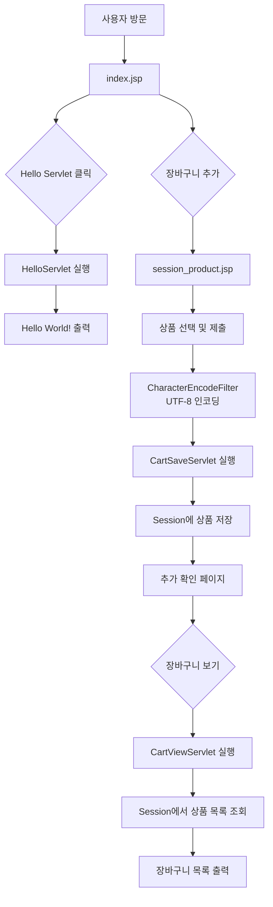

# ex04 - Session & Filter를 활용한 쇼핑카트 프로젝트

## 📋 프로젝트 개요

이 프로젝트는 **Java Servlet/JSP**를 기반으로 한 웹 애플리케이션으로, **HTTP Session**을 활용하여 사용자의 장바구니 정보를 서버에 저장하고, **Filter**를 통해 문자 인코딩을 관리합니다.

---

## 🏗️ 프로젝트 구조

```
ex04/
├── src/main/
│   ├── java/
│   │   └── org/scoula/ex04/
│   │       ├── HelloServlet.java
│   │       ├── filter/
│   │       │   └── CharacterEncodeFilter.java
│   │       └── session/
│   │           ├── CartSaveServlet.java
│   │           └── CartViewServlet.java
│   └── webapp/
│       ├── index.jsp
│       ├── session_product.jsp
│       └── WEB-INF/
│           └── web.xml
├── build.gradle
├── settings.gradle
└── gradle 빌드 설정 파일들
```

---

## 🔄 시스템 플로우



---

## 📁 파일 상세 설명

### 1️⃣ **Java Servlet & Filter 클래스**

| 파일명 | 경로 | 설명 | URL Mapping |
|--------|------|------|------------|
| **HelloServlet** | `org.scoula.ex04` | 기본 Servlet 예제, "Hello World!" 출력 | `/hello-servlet` |
| **CharacterEncodeFilter** | `org.scoula.ex04.filter` | 모든 요청의 UTF-8 인코딩 처리 | `/*` (모든 경로) |
| **CartSaveServlet** | `org.scoula.ex04.session` | 상품을 Session에 저장 | `/cart_save` |
| **CartViewServlet** | `org.scoula.ex04.session` | Session에서 상품 목록 조회 | `/cart_view` |

### 2️⃣ **JSP 뷰 페이지**

| 파일명 | 설명 |
|--------|------|
| **index.jsp** | 애플리케이션 진입점, Hello Servlet 링크 제공 |
| **session_product.jsp** | 상품 선택 폼 (라디오버튼: BMW, SM5, K7) |

---

## 💻 핵심 코드

### CharacterEncodeFilter.java
UTF-8 문자 인코딩을 처리하는 필터입니다. 모든 HTTP 요청(`/*`)에 대해 한글 문자 처리를 보장합니다.

```java
package org.scoula.ex04.filter;

import javax.servlet.*;
import javax.servlet.annotation.WebFilter;
import java.io.IOException;

@WebFilter(urlPatterns={ "/*" })
public class CharacterEncodeFilter implements Filter {
    @Override
    public void init(FilterConfig filterConfig) throws ServletException {
        System.out.println("필터 초기화 담당");
    }

    @Override
    public void doFilter(ServletRequest request,
                         ServletResponse response,
                         FilterChain chain) throws IOException, ServletException {
        request.setCharacterEncoding("UTF-8");
        chain.doFilter(request, response);
    }

    @Override
    public void destroy() {
        System.out.println("필터 소멸됨.");
    }
}
```

### CartSaveServlet.java
사용자가 선택한 상품을 Session에 저장하는 Servlet입니다.

```java
package org.scoula.ex04.session;

import javax.servlet.ServletException;
import javax.servlet.annotation.WebServlet;
import javax.servlet.http.HttpServlet;
import javax.servlet.http.HttpServletRequest;
import javax.servlet.http.HttpServletResponse;
import javax.servlet.http.HttpSession;
import java.io.IOException;
import java.io.PrintWriter;
import java.util.ArrayList;

@WebServlet("/cart_save")
public class CartSaveServlet extends HttpServlet {

    @Override
    protected void doGet(HttpServletRequest req, HttpServletResponse resp) throws ServletException, IOException {
        String product = req.getParameter("product");
        System.out.println("받은 데이터는 " + product);

        // 세션 객체 얻어오기
        HttpSession session = req.getSession();
        ArrayList<String> list = (ArrayList<String>)session.getAttribute("product");

        if (list == null){
            // 첫 번째 상품 추가 시 List 생성
            list = new ArrayList<String>();
            session.setAttribute("product", list);
        }

        list.add(product);
        System.out.println("현재까지 장바구니 내용");
        System.out.println(session.getAttribute("product"));
        
        resp.setContentType("text/html;charset=utf-8");
        PrintWriter out = resp.getWriter();
        out.println("<html><body>");
        out.println("<h1>당신이 추가한 물건 이름은 " + product + "</h1>");
        out.println("<a href='session_product.jsp'>장바구니 추가 화면으로 이동</a><br>");
        out.println("<a href='cart_view'>장바구니 보기 화면으로 이동</a>");
        out.println("</body></html>");
    }

    @Override
    protected void doPost(HttpServletRequest req, HttpServletResponse resp) throws ServletException, IOException {
        doGet(req, resp);
    }
}
```

### CartViewServlet.java
Session에 저장된 장바구니 상품 목록을 조회하고 출력하는 Servlet입니다.

```java
package org.scoula.ex04.session;

import javax.servlet.ServletException;
import javax.servlet.annotation.WebServlet;
import javax.servlet.http.HttpServlet;
import javax.servlet.http.HttpServletRequest;
import javax.servlet.http.HttpServletResponse;
import javax.servlet.http.HttpSession;
import java.io.IOException;
import java.io.PrintWriter;
import java.util.ArrayList;

@WebServlet("/cart_view")
public class CartViewServlet extends HttpServlet {

    @Override
    protected void doGet(HttpServletRequest req, HttpServletResponse resp) throws ServletException, IOException {
        resp.setContentType("text/html;charset=UTF-8");
        PrintWriter out = resp.getWriter();
        out.println("<html><body>");
        out.println("<h1>장바구니 목록</h1>");
        out.println("<hr>");
        
        HttpSession session = req.getSession(false);
        if (session != null) {
            ArrayList<String> list = ( ArrayList<String>) session.getAttribute("product");
            out.println("<h1>" + list + "</h1>");
        }else{
            out.println("세션이 없음.");
        }
        
        out.println("<a href='session_product.jsp'>장바구니 추가 화면으로 이동</a><br>");
        out.println("<a href='cart_delete'>장바구니 삭제 화면으로 이동</a>");
        out.println("</body></html>");
    }
}
```

### HelloServlet.java
기본적인 Servlet 예제입니다.

```java
package org.scoula.ex04;

import java.io.*;
import javax.servlet.http.*;
import javax.servlet.annotation.*;

@WebServlet(name = "helloServlet", value = "/hello-servlet")
public class HelloServlet extends HttpServlet {
    private String message;

    public void init() {
        message = "Hello World!";
    }

    public void doGet(HttpServletRequest request, HttpServletResponse response) throws IOException {
        response.setContentType("text/html");
        PrintWriter out = response.getWriter();
        out.println("<html><body>");
        out.println("<h1>" + message + "</h1>");
        out.println("</body></html>");
    }

    public void destroy() {
    }
}
```

---

## 🎯 핵심 개념 정리

| 개념 | 설명 | 사용처 |
|------|------|--------|
| **Session** | 서버에 저장되는 사용자 상태 정보 (유지 기간 동안 유지) | 장바구니 데이터 저장 |
| **Filter** | 모든 요청/응답을 전처리/후처리하는 컴포넌트 | 문자 인코딩 처리 |
| **@WebServlet** | URL 패턴을 Servlet 클래스와 매핑하는 애노테이션 | 라우팅 설정 |
| **HttpSession** | 클라이언트별 고유한 세션 객체 | 사용자별 데이터 관리 |
| **ArrayList** | 동적 배열로 여러 상품을 저장 | 장바구니 목록 관리 |

---

## 🚀 사용 방법

1. **프로젝트 빌드**
   ```bash
   ./gradlew build
   ```

2. **애플리케이션 실행**
   - 서버 시작 (Tomcat 등)
   - `http://localhost:8080/ex04/` 접속

3. **기능 테스트**
   - `index.jsp` → Hello Servlet 클릭
   - `session_product.jsp` → 상품 선택 → 카트에 저장
   - `cart_view` → 장바구니 목록 확인

---

## 📝 기술 스택

- **Language**: Java
- **Framework**: Jakarta Servlet/JSP
- **Build Tool**: Gradle
- **Character Encoding**: UTF-8
- **Web Server**: Apache Tomcat (권장)

---

## 📌 주요 학습 포인트

✅ HTTP Session을 이용한 상태 정보 관리  
✅ Filter를 통한 문자 인코딩 처리  
✅ Servlet과 JSP 연동  
✅ @WebServlet 애노테이션을 이용한 URL 매핑  
✅ ArrayList를 이용한 동적 데이터 관리  

---

## 📄 요약


<br>


<br>

```
package org.scoula.ex04;

import jakarta.servlet.*;
import jakarta.servlet.annotation.WebFilter;
import jakarta.servlet.http.HttpServletRequest;

import java.io.IOException;

@WebFilter(urlPatterns = "/*")
public class RequestLogFilter implements Filter {

    @Override
    public void init(FilterConfig filterConfig) throws ServletException {
        System.out.println("RequestLogFilter 초기화");
    }

    @Override
    public void doFilter(ServletRequest request,
                         ServletResponse response,
                         FilterChain chain)
            throws IOException, ServletException {

        // ServletRequest를 HttpServletRequest로 형변환
        HttpServletRequest req = (HttpServletRequest) request;

        // 요청 URI 출력
        String uri = req.getRequestURI();
        System.out.println("[요청 URL] " + uri);

        // 다음 필터 또는 서블릿으로 이동
        chain.doFilter(request, response);
    }

    @Override
    public void destroy() {
        System.out.println("RequestLogFilter 종료");
    }
}

```

<br>

```

필터 적용 순서가 중요한 경우(web.xml에 등록한 순서대로 필터가 적용됨.)
<filter>
    <filter-name>encodingFilter</filter-name>
    <filter-class>org.scoula.filter.CharacterEncodingFilter</filter-class>
</filter>

<filter-mapping>
    <filter-name>encodingFilter</filter-name>
    <url-pattern>/*</url-pattern>
</filter-mapping>

<filter>
    <filter-name>requestLogFilter</filter-name>
    <filter-class>org.scoula.filter.RequestLogFilter</filter-class>
</filter>

<filter-mapping>
    <filter-name>requestLogFilter</filter-name>
    <url-pattern>/*</url-pattern>
</filter-mapping>

```

<br>


